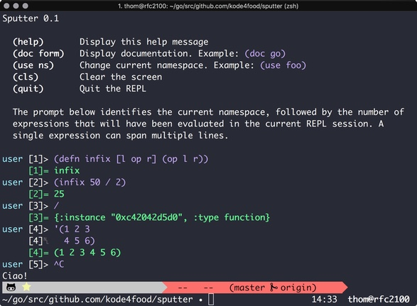

# Ale is a Lisp Environment
[](https://goreportcard.com/report/gitlab.com/kode4food/ale) [](https://travis-ci.org/kode4food/ale) [](https://coveralls.io/github/kode4food/ale?branch=master)

Ale is a Lisp Environment written in [Go](https://golang.org/).

## How To Install
Make sure your `GOPATH` is set, then run `go get` to retrieve the package.

```bash
go get gitlab.com/kode4food/ale/cmd/ale
```

## How To Run A Source File
Once you've installed the package, you can run it from `GOPATH/bin` like so:

```bash
ale somefile.lisp

# or

cat somefile.lisp | ale
```

## How To Start The REPL
Ale has a very crude Read-Eval-Print Loop that will be more than happy
to start if you call it with no arguments from the terminal:



## Current Status
Still a work in progress, and the compiler is pretty fragile, but that will
change rapidly. The current built-in forms are:

  * Basics: `read` `eval` `do`
  * Branching: `if` `not` `unless` `when` `when-not` `cond` `and` `or`
  * Numeric: `+` `-` `*` `/` `mod` `=` `!=` `<` `>` `<=` `>=` `inf` `-inf` `inc` `dec` `range`
  * Numeric Predicates: `inf?` `-inf?` `nan?` `even?` `odd?`
  * Values: `def` `let` `if-let` `when-let` `declare`
  * Symbols and Keywords: `sym` `gensym` `sym?` `local?` `keyword?`
  * Functions: `defn` `fn` `apply` `partial` `apply?` `special-form?`
  * Function Composition: `juxt` `comp`
  * Threading: `->` `->>` `some->` `some->>` `as->` `cond->` `cond->>`
  * Macros: `defmacro` `macroexpand1` `macroexpand` `macroexpand-all` `macro?`
  * Errors: `error` `raise` `panic` `try` `assert-args`
  * Quoting: `quote` `syntax-quote`
  * Predicates: `eq` `atom?` `nil?`
  * Sequences: `seq` `cons` `conj` `first` `rest` `last` `for-each` `seq?`
  * Lists: `list` `to-list` `list?`
  * Vectors: `vector` `to-vector` `vector?`
  * Associative Arrays: `assoc` `to-assoc` `assoc?`
  * Counted Sequences: `len` `len?`
  * Indexed Sequences: `nth` `indexed?`
  * Mapped Sequences: `get` `.` `mapped?`
  * Comprehensions: `concat` `map` `filter` `reduce` `take` `take-while` `drop`
  * Lazy Sequences: `lazy-seq` `partition`
  * Concurrency: `go` `chan` `generate` `future` `promise` `promise?`
  * Strings: `str` `str!` `str?`
  * I/O: `print` `println` `pr` `prn` `with-open`
  * Operating System: `time` `*env*` `*args*` `*out*` `*err*` `*in*`

Documentation for most of these forms may be viewed in the REPL using the
`doc` function.
