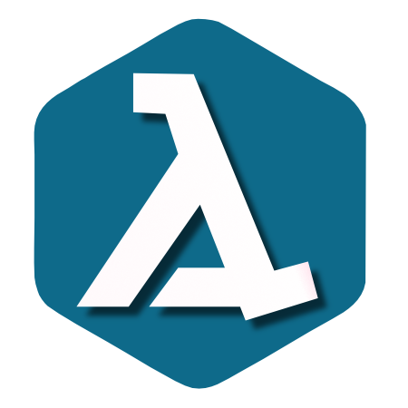

# Ale is a Lisp Environment 

 [](https://qlty.sh/gh/kode4food/projects/ale) [](https://qlty.sh/gh/kode4food/projects/ale) [](https://github.com/kode4food/ale/blob/main/LICENSE.md)

Ale is a Lisp Environment for [Go](https://golang.org/) applications

## How To Install

Make sure your `GOPATH` is set, then run `go install` to install the command line tool.

```bash
go install github.com/kode4food/ale/cmd/ale@latest
```

You can also install it from the cloned repository using make.

```bash
make install
```

## How To Run A Source File

Once you've installed the package, you can run it from `GOPATH/bin` like so:

```bash
ale somefile.ale

# or

cat somefile.ale | ale

## or

ale <<EOF
(let [ch (chan)]
  (go (: ch :emit "Hello")
      (: ch :emit "Ale!")
      (: ch :close))

  (apply println (ch :seq)))
EOF
```

## How To Start The REPL

Ale has a very crude Read-Eval-Print Loop that will be more than happy
to start if you invoke `ale` with no arguments from your shell.

## Current Status

Still a work in progress. Use at your own risk.
